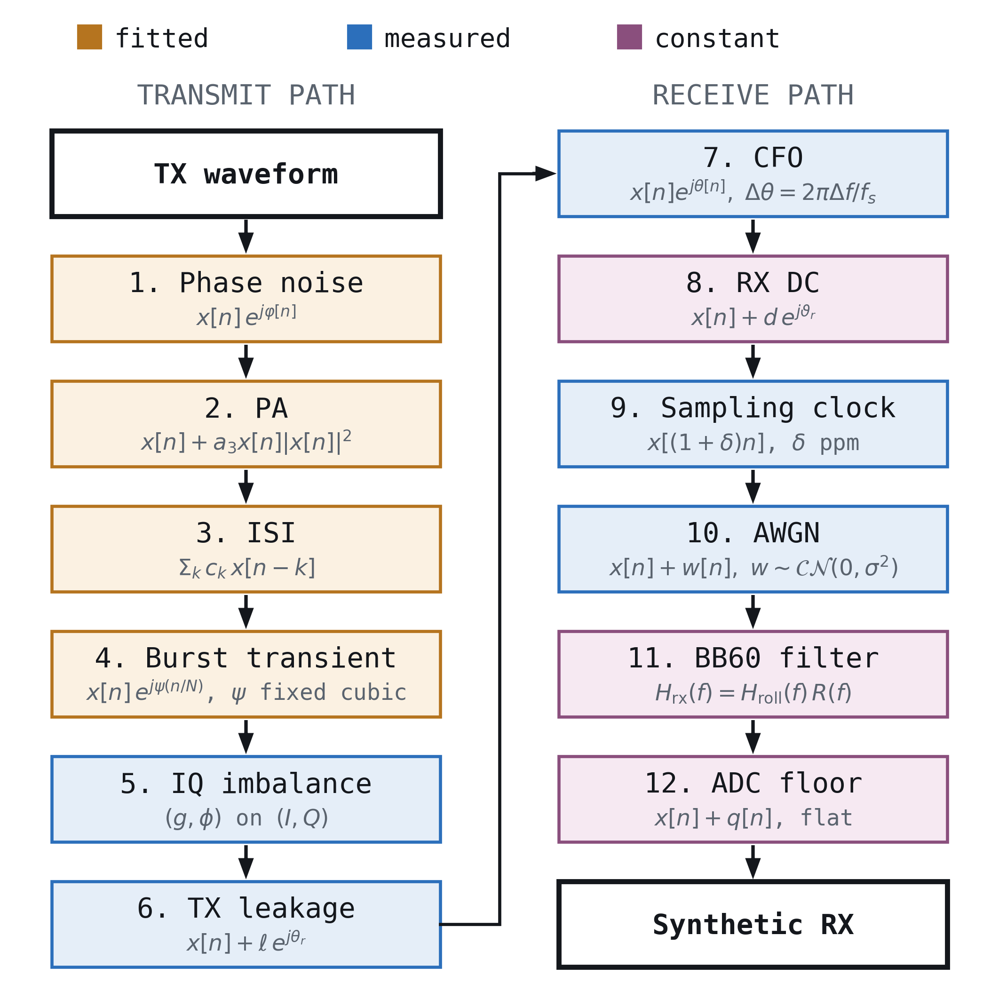
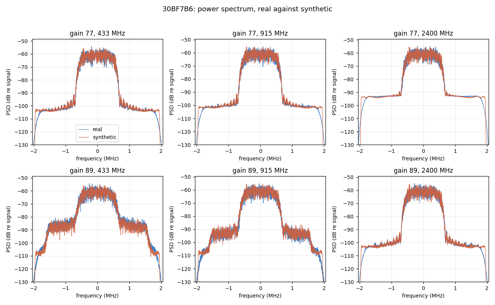
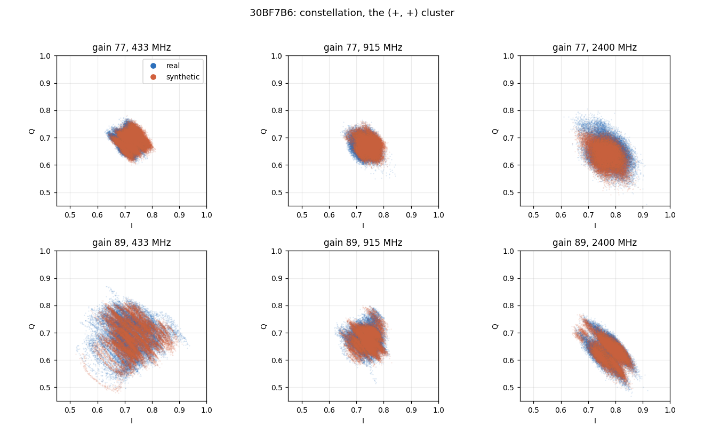
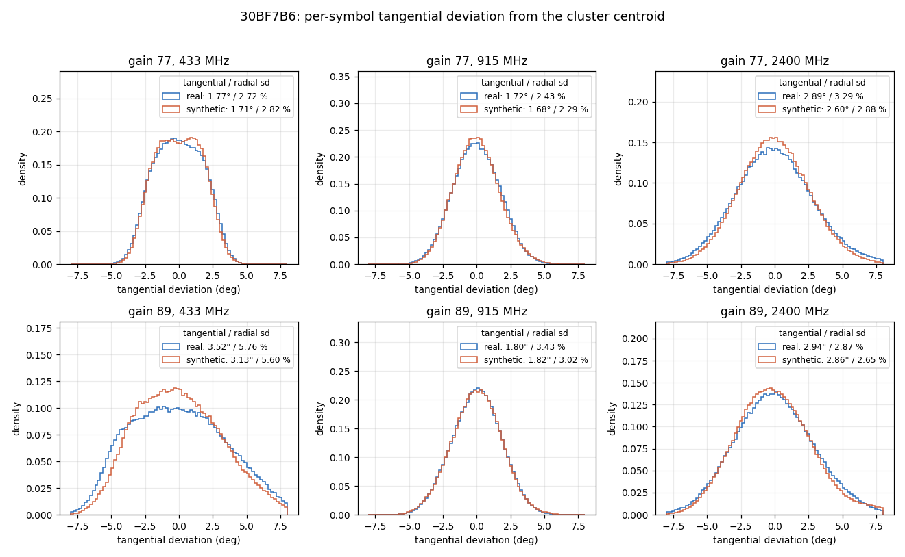

# Synthetic RF Fingerprint Generator

**Note: Claude (Anthropic) assisted with coding, analysis, and documentation formatting. Measurements, modeling, and validation are original author work.**

Generates synthetic SRRC-QPSK captures in SigMF format from measured profiles of 24 real USRP B210 transmitters. Hardware impairments are fitted from real captures. By default only the device-fixed ones stay per radio; everything else is drawn from the whole fleet on every run. Output matches the real capture layout, so the same analysis code reads real and synthetic data.

Sample dataset (full set pending a storage solution): https://drive.google.com/drive/folders/1A3LalT3Ojt_YU07PwynkjhlF8aStcJZV?usp=sharing

## Install

```bash
pip install -r requirements.txt
```

Python 3.10+ (tested on 3.13.5). The generator needs only `numpy` and `scipy`; the notebooks also need `matplotlib` and `notebook`.

## Tutorials

1. **`getting_started.ipynb`** — generate from a real device profile: fixed vs. varying parameters, constellations, writing a dataset. Under a minute.
2. **`build_your_own_radio.ipynb`** — build a transmitter by hand, for sweeps, controlled fleets and stress cases.
3. **`estimators.ipynb`** — the reverse: recover each impairment from a capture and score it against the injected truth.
4. **`paper_figures.ipynb`** — reproduce the paper's measurement figures. Under a minute.
5. **`wifi_reconstruction.ipynb`** — rebuild a real 802.11g capture block by block from fitted impairments (the measurement side, not the generator).

The figure scripts in `analysis_scripts/` also run on their own; `fig_wifi_reconstruction.py` is the one no notebook calls.

## Quickstart

```bash
# preview the profile and variation spec
python synth_dataset.py --radio 30BF7B6 --config 77_433 --dry-run

# generate 2 runs of 6 bursts
python synth_dataset.py --radio 30BF7B6 --config 77_433 --runs 2 --bursts 6 --out ./out
```

`--config` is `<gain>_<band MHz>`: gain 77 or 89, band 433, 915 or 2400.

| Flag | Effect |
| :--- | :--- |
| `--rx-spur` | Add the BB60 receiver's phase spur, which real captures carry (off by default). |
| `--snr-drop-db X` | How far below the fleet's lowest measured SNR the per-run SNR reaches (default 10 dB). |
| `--per-radio-nuisance` | Previous variation: every impairment at this radio's own measured spread. |
| `--gate-pa-2400` | Previous PA at gain 89, 2400 MHz: cubic switched off. |
| `--full-transient` | Previous burst transient: each radio's own complex cubic. |
| `--raw-taps` | Previous ISI: each radio's own two fitted taps. |
| `--bb60-passband` | Previous receive filter: the measured BB60 response even where the fits already contain its passband. |
| `--random-pa-mod-phase` | Previous gain-89 PA modulation: a uniform random start phase per run. |
| `--old-pa-mod-swing` | Previous gain-89 PA modulation: only the PA cubic swings, the ISI taps stay fixed. |
| `--per-burst-pn` | Previous phase-noise model: an independent draw per burst. |
| `--cubic-preamble` | Previous burst transient: the fitted cubic extrapolated over the preamble. |
| `--no-pa-clean` | Previous PA fit (joint least squares). |
| `--no-pa-mod` | Leave out the gain-89 PA modulation. |
| `--old-leakage` | Previous TX LO leakage and carrier offset. |

The opt-out flags reproduce earlier output bit for bit; [`CHANGELOG.md`](CHANGELOG.md) says which flag goes with which version.

### Fingerprint-only variation (default)

Re-capturing the same radios weeks later showed which impairments belong to the device. Those stay per radio; the rest are drawn from the whole fleet, so a classifier trained on the output has to rely on the device.

| Per radio (fingerprint) | Drawn from the fleet each run |
| :--- | :--- |
| Carrier and clock offset (spread widened by the drift measured over a session) | ISI shift (`isi_shift_khz`): it follows the capture day, not the radio |
| TX LO leakage | IQ imbalance: mostly run-to-run noise |
| PA cubic | Receiver DC |
| Phase-noise level | SNR, extended 10 dB below anything measured |
| Burst-transient level | |

### Output layout

```text
out/77_433/
  profile.json              # device profile and variation spec
  ground_truth.json         # exact per-run values of every varying parameter
  run_001/valid/
    *_tx_*.sigmf-data/meta  # transmitted waveform
    capture_*_combined.*    # synthetic receive capture
```

`ground_truth.json` lets you score an estimator against the injected value rather than against another estimator.

## Signal chain

<p align="center"></p>

Fitted blocks are held fixed per radio; measured blocks are redrawn each run; constant blocks belong to the receiver. The figure shows the per-radio spec (`--per-radio-nuisance`); by default the ISI taps, IQ imbalance, receiver DC and SNR come from the fleet instead (see Quickstart). Not drawn: the gain-89 PA modulation (inside the PA), the measured preamble transient (inside the burst transient), the leakage tone's small offset from the CFO, and the receiver spur (`--rx-spur`).

| Data file | What it sets |
| :--- | :--- |
| `data/radio_characterisation.json` | Per-run measurements (clock, IQ, SNR, ...) that set each parameter's centre and spread: each radio's first capture session, the same session every fit comes from. |
| `data/isi_taps.json` | Per radio/config: ISI taps, PA cubic and burst transient. |
| `data/srrc_ripple_per_config.json` | Common-mode band ripple, one FIR per config. |
| `data/pn_curves.json` | Phase noise: one curve per radio/config (1.5 Hz–500 kHz), drawn as one process per run. |
| `data/srrc_preamble_transient.json` | Measured burst transient over the preamble, per config. |
| `data/pa_gain_mod.json` | Gain-89 PA modulation, fleet-wide. |
| `data/lo_leakage.json` | TX LO leakage level and precise carrier offset, per run. |
| `data/rx_spur.json` | Receiver phase spur, used only with `--rx-spur`. |
| `data/bb60_rx_fir_5msps_n10.npy` | Measured BB60C anti-alias response. |
| `data/repeat_log.json`, `data/fitted_blocks_30BF779_89_433.npz` | Data for the cross-session and fidelity figures. |

Each fitted file records the measurements it came from and how. `rx_spur.py` estimates, removes or adds the receiver spur on any capture.

### Parameter count

Real-valued numbers, default settings.

**Per radio and config (30):**

| Block | Parameters |
| :--- | :--- |
| Phase-noise curve | 19 (levels at 1.5 Hz–500 kHz) |
| Burst-transient level (`transient_level_deg`) | 1 |
| ISI shift `isi_shift_khz` (drawn from the fleet by default) | 1 |
| PA cubic *b* (complex) | 2 |
| Carrier offset: centre and run-to-run spread | 2 |
| Clock offset from the carrier offset | 1 |
| TX LO leakage: centre, spread, bounds | 4 (8 where a two-state mixture is used) |

The shipped data has 144 radio/config profiles (24 radios), so about 4,300 per-radio numbers.

**Shared by all radios, per config:**

| Block | Parameters |
| :--- | :--- |
| Band ripple | 48 (24 complex frequency bins, applied as a 301-tap FIR) |
| Burst-transient shape (complex cubic) | 6 |
| Post-PA response: two fixed taps at ±1 symbol, slid in frequency by `isi_shift_khz` | 4 |
| Preamble transient profile | 10 |
| Gain-89 PA modulation (433 and 915 MHz) | 10 (rate, gain step, complex cubic swing, two complex tap swings, start phase and its spread) |
| Leakage tone offset from the carrier | 1 per band |
| Fleet pools: IQ imbalance, receiver DC | 3 × 101 quantiles |
| SNR range, carrier drift, ISI shift spread | 4 |
| Receiver spur (`--rx-spur` only) | 4 |

The BB60C anti-alias filter is a measured response of the receiver, not fitted to any radio.

With `--per-radio-nuisance`, each radio/config also carries its own IQ imbalance (4), SNR (2), receiver DC (1) and carrier-offset memory (1), while the fleet pools and SNR range are not used.

## Results

One radio, 30BF7B6, in all six configurations: a real capture from the session its fits come from, against the generator's output for that radio (`--per-radio-nuisance`, so SNR and the other nuisance terms are the radio's own), demodulated the same way. The real capture has the receiver spur removed, since the generator leaves it out by default.

**Spectrum.** The in-band shape, the noise floor and, at gain 89 (433 and 915 MHz), the PA's spectral regrowth all line up.

<p align="center"></p>

**Constellation.** The synthetic clusters reproduce the real shapes, including the elongated gain-89 clusters.

<p align="center"></p>

**Per-symbol deviation.** The tangential and radial spreads are within about 12 % of real in every configuration. The synthetic constellation is slightly tighter in most of them, most at 89 / 433 MHz (3.1° against 3.5° tangential), which is the gain-89 shortfall under Known limitations.

<p align="center"></p>

The figure comes from `analysis_scripts/fig_readme_results.py` in the measurement repository; the real captures are not shipped.

## Variation kinds

Each parameter in the variation spec has a `kind`:

| Kind | Redrawn each run as |
| :--- | :--- |
| `fixed` | Not redrawn: held at the profile value. |
| `derived` | Tied to another parameter (the sampling clock follows the reference oscillator). |
| `uniform` | Uniform over a range (phases, sampling-grid offset). |
| `gauss` | Gaussian at the measured spread, optionally bounded. |
| `ar1` | Gaussian that wanders across runs (memory set by `phi`). |
| `mixture` | Gaussian mixture (e.g. TX LO leakage in gain-89 sessions with two states). |
| `quantile` | Empirical distribution given by its percentiles (the fleet's IQ imbalance and receiver DC). |
| `pool` | One of a list of fitted vectors (the fleet's ISI tap sets). |
| `scipy` | Any `scipy.stats` distribution, by name. |

## Known limitations

- **Bursts are slightly too clean.** The burst-to-burst deviation is 0.5–1 dB below real at gain 77 and 1–2.5 dB at gain 89, and the gain-89 AM/AM droop is off by 0.2–0.35 dB. Within a run the per-symbol spread is about 6–7 % narrower than real throughout the gain-89 modulation cycle. The default's wider SNR range masks the burst-to-burst part.
- **In-burst frequency pull is not modelled.** While transmitting data, real radios sit about 7 ppb below their long-term frequency.
- **Phase noise above ~200 kHz** is below the thermal noise at 2400 MHz and on some 89_433 radios, so there the curve is set by the total in-burst variance and a no-rise constraint.
- **A few profiles carry wideband tangential noise that is not LO phase noise** (30BF7C1/89_433, and milder 30ECB71/89_915); one curve reproduces 0.82–0.90× of it.
- **ISI is three fixed taps**, so amplitude states are slightly sharper than on real hardware.
- **Two-state leakage at gain 89** is fitted as a mixture; its mechanism is unresolved.
- **`clock_phase_mean_samp`** in the log is a wrapping artifact, not a radio property.

## Bundled library

`PA_modelling_with_GMP/cel_signal_gen_lib` is a trimmed copy of the impairment and filter-design library.

**Licensing:** `core/filter_design.py` includes SRRC design code by Matt @ WaveWalkerDSP.com (Copyright 2021), released under the MIT license. This notice must be retained in any redistribution.

## Update log

See [`CHANGELOG.md`](CHANGELOG.md).
